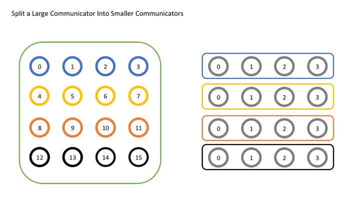
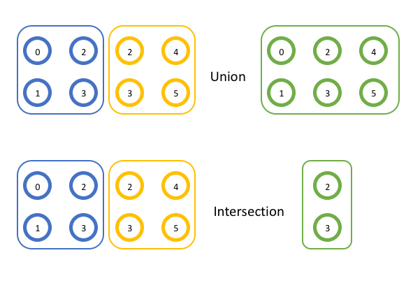

在以前的教程中，我们使用了通讯器 `MPI_COMM_WORLD`。
对于简单的程序，这已经足够了，因为我们的进程数量相对较少，并且通常要么一次要与其中之一对话，要么一次要与所有对话。
当程序规模开始变大时，这变得不那么实用了，我们可能只想一次与几个进程进行对话。
在本次教程中，我们将展示如何创建新的通讯器，以便一次与原始线程组的子集进行沟通。

> **注意**- 本站点的所有代码都在 [GitHub]({{ site.github.repo }}) 上。本教程的代码在 [tutorials/introduction-to-groups-and-communicators/code]({{ site.github.code }}/tutorials/introduction-to-groups-and-communicators/code) 目录下。

## 通讯器概述

正如我们在学习集体例程时所看到的那样，MPI 允许您立即与通讯器中的所有进程进行对话，以执行诸如使用 `MPI_Scatter` 将数据从一个进程分发到多个进程或使用 `MPI_Reduce` 执行数据归约的操作。
但是，到目前为止，我们仅使用了默认的通讯器 `MPI_COMM_WORLD`。

对于简单的应用程序，使用 `MPI_COMM_WORLD` 进行所有操作并不罕见，但是对于更复杂的用例，拥有更多的通讯器可能会有所帮助。
例如，如果您想对网格中进程的子集执行计算。
例如，每一行中的所有进程都可能希望对一个值求和。
这将是第一个也是最常见的用于创建新的通讯器的函数：

```cpp
MPI_Comm_split(
	MPI_Comm comm,
	int color,
	int key,
	MPI_Comm* newcomm)
```

顾名思义，`MPI_Comm_split` 通过基于输入值 `color` 和 `key` 将通讯器“拆分”为一组子通讯器来创建新的通讯器。
在这里需要注意的是，原始的通讯器并没有消失，但是在每个进程中都会创建一个新的通讯器。
第一个参数 `comm` 是通讯器，它将用作新通讯器的基础。
这可能是 `MPI_COMM_WORLD`，但也可能是其他任何通讯器。
第二个参数 `color` 确定每个进程将属于哪个新的通讯器。
为 `color` 传递相同值的所有进程都分配给同一通讯器。
如果 `color` 为 `MPI_UNDEFINED`，则该进程将不包含在任何新的通讯器中。
第三个参数 `key` 确定每个新通讯器中的顺序（秩）。
传递 `key` 最小值的进程将为 0，下一个最小值将为 1，依此类推。
如果存在平局，则在原始通讯器中秩较低的进程将是第一位。
最后一个参数 `newcomm` 是 MPI 如何将新的通讯器返回给用户。

## 使用多个通讯器的示例

现在，让我们看一个简单的示例，在该示例中，我们尝试将单个全局通讯器拆分为一组较小的通讯器。
在此示例中，我们将想象我们已经在逻辑上将原始通讯器布局为共 16 个进程的 4x4 网格，并且希望按行划分网格。
为此，每一行将获得自己的颜色（参数 `color`）。
在下图中，您可以看到左图具有相同颜色的每组进程如何最终变成右图的自己的通讯器。



让我们看一下代码。

```cpp
// 获取原始通讯器的秩和大小
int world_rank, world_size;
MPI_Comm_rank(MPI_COMM_WORLD, &world_rank);
MPI_Comm_size(MPI_COMM_WORLD, &world_size);

int color = world_rank / 4; // 根据行确定颜色

// 根据颜色拆分通讯器，然后调用
// 利用原始秩
MPI_Comm row_comm;
MPI_Comm_split(MPI_COMM_WORLD, color, world_rank, &row_comm);

int row_rank, row_size;
MPI_Comm_rank(row_comm, &row_rank);
MPI_Comm_size(row_comm, &row_size);

printf("WORLD RANK/SIZE: %d/%d \t ROW RANK/SIZE: %d/%d\n",
	world_rank, world_size, row_rank, row_size);

MPI_Comm_free(&row_comm);
```

前几行获得原始通讯器 `MPI_COMM_WORLD` 的秩和大小。
下一行执行确定局部进程 `color` 的重要操作。
请记住，`color` 决定了拆分后该进程所属的通讯器。
接下来，我们将看到所有重要的拆分操作。
这里的新事物是，我们使用原始秩（`world_rank`）作为拆分操作的 `key`。
由于我们希望新通讯器中的所有进程与原始通讯器中的所有进程处于相同的顺序，因此在这里使用原始等级值最有意义，因为它已经正确地排序了。
之后，我们将打印出新的等级和大小以确保其有效。
您的输出应如下所示：

```
WORLD RANK/SIZE: 0/16 	 ROW RANK/SIZE: 0/4
WORLD RANK/SIZE: 1/16 	 ROW RANK/SIZE: 1/4
WORLD RANK/SIZE: 2/16 	 ROW RANK/SIZE: 2/4
WORLD RANK/SIZE: 3/16 	 ROW RANK/SIZE: 3/4
WORLD RANK/SIZE: 4/16 	 ROW RANK/SIZE: 0/4
WORLD RANK/SIZE: 5/16 	 ROW RANK/SIZE: 1/4
WORLD RANK/SIZE: 6/16 	 ROW RANK/SIZE: 2/4
WORLD RANK/SIZE: 7/16 	 ROW RANK/SIZE: 3/4
WORLD RANK/SIZE: 8/16 	 ROW RANK/SIZE: 0/4
WORLD RANK/SIZE: 9/16 	 ROW RANK/SIZE: 1/4
WORLD RANK/SIZE: 10/16 	 ROW RANK/SIZE: 2/4
WORLD RANK/SIZE: 11/16 	 ROW RANK/SIZE: 3/4
WORLD RANK/SIZE: 12/16 	 ROW RANK/SIZE: 0/4
WORLD RANK/SIZE: 13/16 	 ROW RANK/SIZE: 1/4
WORLD RANK/SIZE: 14/16 	 ROW RANK/SIZE: 2/4
WORLD RANK/SIZE: 15/16 	 ROW RANK/SIZE: 3/4
```

如果您的顺序不正确，请不要惊慌。
当您在 MPI 程序中显示内容时，每个进程都必须将其输出发回启动 MPI 作业的位置，然后才能将其打印到屏幕上。
这往往意味着排序变得混乱，因为您永远无法假设仅以特定的秩顺序打印内容，即输出结果实际上将按照您期望的顺序结束，但是显示不是。
只是在这里重新排列输出内容，以至看起来不错。

最后，我们使用 `MPI_Comm_free` 释放通讯器。
这似乎不是一个重要的步骤，但与在其他任何程序中使用完内存后释放内存一样重要。
当不再使用 MPI 对象时，应将其释放，以便以后重用。
MPI 一次可以创建的对象数量有限，如果 MPI 用完了可分配对象，则不释放对象可能会导致运行时错误。

## 其他通讯器创建函数

尽管 `MPI_Comm_split` 是最常见的通讯器创建函数，但还有许多其他函数。
`MPI_Comm_dup` 是最基本的，它创建了一个通讯器的副本。
似乎存在一个仅创建副本的函数似乎很奇怪，但这对于使用库执行特殊函数的应用（例如数学库）非常有用。
在这类应用中，重要的是用户代码和库代码不要互相干扰。
为了避免这种情况，每个应用程序应该做的第一件事是创建 `MPI_COMM_WORLD` 的副本，这将避免其他使用 `MPI_COMM_WORLD` 的库的问题。
库本身也应该复制 `MPI_COMM_WORLD` 以避免相同的问题。

另一个功能是 `MPI_Comm_create`。
乍一看，此功能与 `MPI_Comm_create_group` 非常相似。
其原型几乎相同：

```cpp
MPI_Comm_create(
	MPI_Comm comm,
	MPI_Group group,
    MPI_Comm* newcomm)
```

然而，主要区别（除了缺少 `tag` 参数之外）是，`MPI_Comm_create_group` 仅是 `group` 中包含的一组进程的集合，而 `MPI_Comm_create` 是 `comm` 中每个进程的集合。
当通讯器的规模很大时，这是一个重要的区别。
如果尝试在运行 1,000,000 个进程时创建 `MPI_COMM_WORLD` 的子集，则重要的是使用尽可能少的进程来执行该操作，因为大型集的开销会变得非常昂贵。

通讯器还有其他一些更高级的功能，我们在这里不介绍，例如内部通讯器与内部通讯器之间的差异以及其他高级通讯器创建功能。
这些仅用于非常特殊的应用，以后的教程中可能会介绍这些应用程序。

## 组的概述

尽管 `MPI_Comm_split` 是创建新通讯器的最简单的方法，但并非唯一的方法。
创建通讯器有更灵活的方法，但是它们使用一种新的 MPI 对象 `MPI_Group`。
在详细讨论组之前，让我们再回顾一下通讯器的实际含义。
在内部，MPI 必须（除其他事项外）保持通讯器的两个主要部分，即区分一个通讯器与另一个通讯器的上下文（或 ID）以及该通讯器包含的一组进程。
The context is what prevents an operation on one communicator from matching with a similar operation on another communicator.
上下文阻止了与一个通讯器上的操作匹配的另一通讯器上的类似操作。
MPI 在内部为每个通讯器保留一个 ID，以防止混淆。
组更易于理解，因为它只是通讯器中所有进程的集合。
对于 `MPI_COMM_WORLD`，这是由 `mpiexec` 启动的所有进程。
对于其他通讯器，组将有所不同。
在上面的示例代码中，组是所有以相同的 `color` 传参给 `MPI_Comm_split` 的进程。

MPI 使用通常起作用集合理论的相同方式来使用这些组。
您不必熟悉所有的集合理论即可理解 MPI，但是了解两个操作的含义会有所帮助。
首先，**并**会从其他两个集合中创建一个新的（可能）更大的集合。
新集合包括前两个集合的所有成员（无重复）。
其次，**交**会从其他两个集合中创建一个新的（可能）更小的集合。
新集合包括两个原始集合中都存在的所有成员。
您可以在下面以图形方式查看这两个操作的示例。
随后，我们将使用适用于 MPI 的术语“组”（`groups`），而非“集合“（`sets`）。



在第一个示例中，两个组 `{0,1,2,3}` 和 `{2,3,4,5}` 的并集是 `{0,1,2,3,4,5}`，因为这些项中的每一个都出现在组中。
在第二个示例中，两个组 `{0,1,2,3}` 和 `{2,3,4,5}` 的交集为 `{2,3}`，因为每个组中同时仅出现那些项。

## Using MPI groups

现在，我们了解了组工作原理的基础，让我们看看如何将其应用于 MPI 操作。
在 MPI 中，很容易通过 API 调用 `MPI_Comm_group` 来获取通讯器中的进程组。

```cpp
MPI_Comm_group(
	MPI_Comm comm,
	MPI_Group* group)
```

如上所述，通讯器包含一个上下文或 ID，以及一个组。
调用 `MPI_Comm_group` 会得到对该组对象的引用。
组对象的工作方式与通讯器对象相同，不同之处在于您不能使用它与其他秩进行通信（因为它没有附加上下文）。
您仍然可以获取组的秩和大小（分别为 `MPI_Group_rank` 和 `MPI_Group_size`）。
但是，组特有的功能而通讯器无法完成的工作是可以使用组在本地构建新的组。
在此记住本地操作和远程操作之间的区别很重要。
远程操作涉及与其他秩的通信，而本地操作则没有。
创建新的通讯器是一项远程操作，因为所有进程都需要决定相同的上下文和组，而在本地创建组是因为它不用于通信，因此每个进程不需要具有相同的上下文。
您可以随意操作一个组，而无需执行任何通信。

一旦有一个或两个组，对它们执行操作就很简单。
**并**看起来像这样：

```cpp
MPI_Group_union(
	MPI_Group group1,
	MPI_Group group2,
	MPI_Group* newgroup)
```

您可能会猜到**交**看起来像这样：

```cpp
MPI_Group_intersection(
	MPI_Group group1,
	MPI_Group group2,
	MPI_Group* newgroup)
```

在这两种情况下，操作均在 `group1` 和 `group2` 上执行，结果存储在 `newgroup` 中。

MPI 中有许多关于组的用法。
您可以比较组以查看它们是否相同，从另一个组中减去一个组，从组中排除特定秩，或使用一个组将一个组的秩转换为另一组。
但是，MPI 中可能是最有用的一个函数是 `MPI_Comm_create_group`。
这是一个用于创建新通讯器的函数，但无需像 `MPI_Comm_split` 之类那样需要进行计算以决定组成，该函数将使用一个 `MPI_Group` 对象并创建一个与组具有相同进程的新通讯器。

```cpp
MPI_Comm_create_group(
	MPI_Comm comm,
	MPI_Group group,
	int tag,
	MPI_Comm* newcomm)
```

## Example of using groups

让我们看一下使用组的简单示例。
在这里，我们将使用另一个函数，该函数允许您选择组中的特定秩并构建为新组，即 `MPI_Group_incl`。

```cpp
MPI_Group_incl(
	MPI_Group group,
	int n,
	const int ranks[],
	MPI_Group* newgroup)
```

该函数中，`newgroup` 将包含 `group` 中的秩存在于 `ranks` 数组中的 `n` 个进程。
想看看它是如何工作的？
让我们尝试创建一个包含来自 `MPI_COMM_WORLD` 的主要秩的通讯器。

```cpp
// 获取原始通讯器的等级和大小
int world_rank, world_size;
MPI_Comm_rank(MPI_COMM_WORLD, &world_rank);
MPI_Comm_size(MPI_COMM_WORLD, &world_size);

// 获取 MPI_COMM_WORLD 中的进程组
MPI_Group world_group;
MPI_Comm_group(MPI_COMM_WORLD, &world_group);

int n = 7;
const int ranks[7] = {1, 2, 3, 5, 7, 11, 13};

// 构造一个包含 world_group 中所有主要秩的组
MPI_Group prime_group;
MPI_Group_incl(world_group, 7, ranks, &prime_group);

// 根据组创建一个新的通讯器
MPI_Comm prime_comm;
MPI_Comm_create_group(MPI_COMM_WORLD, prime_group, 0, &prime_comm);

int prime_rank = -1, prime_size = -1;
// 如果此秩不在新的通讯器中，则为
// MPI_COMM_NULL。使用 MPI_COMM_NULL 作为 MPI_Comm_rank 或
// MPI_Comm_size 的错误
if (MPI_COMM_NULL != prime_comm) {
	MPI_Comm_rank(prime_comm, &prime_rank);
	MPI_Comm_size(prime_comm, &prime_size);
}

printf("WORLD RANK/SIZE: %d/%d \t PRIME RANK/SIZE: %d/%d\n",
	world_rank, world_size, prime_rank, prime_size);

MPI_Group_free(&world_group);
MPI_Group_free(&prime_group);
MPI_Comm_free(&prime_comm);
```

在此示例中，我们通过仅选择 `MPI_COMM_WORLD` 中的主要秩来构建通讯器。
这是通过 `MPI_Group_incl` 完成的，并将结果存储在 `prime_group` 中。
接下来，我们将该组传递给 `MPI_Comm_create_group` 以创建 `prime_comm`。
最后，我们必须小心不要在没有 `prime_comm` 的进程上使用 `prime_comm`，因此我们要检查以确保通讯器不是 `MPI_COMM_NULL` 状态 —— 不在 `ranks` 中而从 `MPI_Comm_create_group` 返回的结果。
