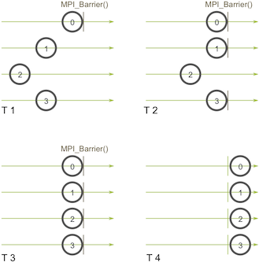
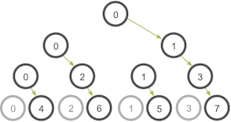

So far in the [MPI tutorials]({{ site.baseurl }}/tutorials/), we have examined point-to-point communication, which is communication between two processes. This lesson is the start of the *collective communication* section. Collective communication is a method of communication which involves participation of **all** processes in a communicator. In this lesson, we will discuss the implications of collective communication and go over a standard collective routine - broadcasting.

> **Note** - All of the code for this site is on [GitHub]({{ site.github.repo }}). This tutorial's code is under [tutorials/mpi-broadcast-and-collective-communication/code]({{ site.github.code }}/tutorials/mpi-broadcast-and-collective-communication/code).

## Collective communication and synchronization points
One of the things to remember about collective communication is that it implies a *synchronization point* among processes. This means that all processes must reach a point in their code before they can all begin executing again.

Before going into detail about collective communication routines, let's examine synchronization in more detail. As it turns out, MPI has a special function that is dedicated to synchronizing processes:

```cpp
MPI_Barrier(MPI_Comm communicator)
```

The name of the function is quite descriptive - the function forms a barrier, and no processes in the communicator can pass the barrier until all of them call the function. Here's an illustration. Imagine the horizontal axis represents execution of the program and the circles represent different processes:



Process zero first calls `MPI_Barrier` at the first time snapshot (T 1). While process zero is hung up at the barrier, process one and three eventually make it (T 2). When process two finally makes it to the barrier (T 3), all of the processes then begin execution again (T 4).

`MPI_Barrier` can be useful for many things. One of the primary uses of `MPI_Barrier` is to synchronize a program so that portions of the parallel code can be timed accurately.

Want to know how `MPI_Barrier` is implemented? Sure you do :-) Do you remember the ring program from the [sending and receiving tutorial]({{ site.baseurl }}/tutorials/mpi-send-and-receive/)? To refresh your memory, we wrote a program that passed a token around all processes in a ring-like fashion. This type of program is one of the simplest methods to implement a barrier since a token can't be passed around completely until all processes work together.

One final note about synchronization - Always remember that every collective call you make is synchronized. In other words, if you can't successfully complete an `MPI_Barrier`, then you also can't successfully complete any collective call. If you try to call `MPI_Barrier` or other collective routines without ensuring all processes in the communicator will also call it, your program will idle. This can be very confusing for beginners, so be careful!

## Broadcasting with MPI_Bcast
A *broadcast* is one of the standard collective communication techniques.  During a broadcast, one process sends the same data to all processes in a communicator. One of the main uses of broadcasting is to send out user input to a parallel program, or send out configuration parameters to all processes.

The communication pattern of a broadcast looks like this:


In this example, process zero is the *root* process, and it has the initial copy of data. All of the other processes receive the copy of data.

In MPI, broadcasting can be accomplished by using `MPI_Bcast`. The function prototype looks like this:

```cpp
MPI_Bcast(
    void* data,
    int count,
    MPI_Datatype datatype,
    int root,
    MPI_Comm communicator)
```

Although the root process and receiver processes do different jobs, they all call the same `MPI_Bcast` function. When the root process (in our example, it was process zero) calls `MPI_Bcast`, the `data` variable will be sent to all other processes. When all of the receiver processes call `MPI_Bcast`, the `data` variable will be filled in with the data from the root process.

## Broadcasting with MPI_Send and MPI_Recv
At first, it might seem that `MPI_Bcast` is just a simple wrapper around `MPI_Send` and `MPI_Recv`. In fact, we can make this wrapper function right now. Our function, called `my_bcast` is located in [bcast.c]({{ site.github.code }}/tutorials/mpi-broadcast-and-collective-communication/code/my_bcast.c). It takes the same arguments as `MPI_Bcast` and looks like this:

```cpp
void my_bcast(void* data, int count, MPI_Datatype datatype, int root,
              MPI_Comm communicator) {
  int world_rank;
  MPI_Comm_rank(communicator, &world_rank);
  int world_size;
  MPI_Comm_size(communicator, &world_size);

  if (world_rank == root) {
    // If we are the root process, send our data to everyone
    int i;
    for (i = 0; i < world_size; i++) {
      if (i != world_rank) {
        MPI_Send(data, count, datatype, i, 0, communicator);
      }
    }
  } else {
    // If we are a receiver process, receive the data from the root
    MPI_Recv(data, count, datatype, root, 0, communicator,
             MPI_STATUS_IGNORE);
  }
}
```

The root process sends the data to everyone else while the others receive from the root process. Easy, right? If you run the my_bcast program from the *tutorials* directory of the [repo]({{ site.github.code }}), the output should look similar to this.


```
>>> cd tutorials
>>> ./run.py my_bcast
mpirun -n 4 ./my_bcast
Process 0 broadcasting data 100
Process 2 received data 100 from root process
Process 3 received data 100 from root process
Process 1 received data 100 from root process
```

Believe it or not, our function is actually very inefficient! Imagine that each process has only one outgoing/incoming network link. Our function is only using one network link from process zero to send all the data. A smarter implementation is a tree-based communication algorithm that can use more of the available network links at once. For example:



In this illustration, process zero starts off with the data and sends it to process one. Similar to our previous example, process zero also sends the data to process two in the second stage. The difference with this example is that process one is now helping out the root process by forwarding the data to process three. During the second stage, two network connections are being utilized at a time. The network utilization doubles at every subsequent stage of the tree communication until all processes have received the data.

Do you think you can code this? Writing this code is a bit outside of the purpose of the lesson. If you are feeling brave, [Parallel Programming with MPI](http://www.amazon.com/gp/product/1558603395/ref=as_li_qf_sp_asin_tl?ie=UTF8&tag=softengiintet-20&linkCode=as2&camp=217145&creative=399377&creativeASIN=1558603395) is an excellent book with a complete example of the problem with code.

## Comparison of MPI_Bcast with MPI_Send and MPI_Recv
The `MPI_Bcast` implementation utilizes a similar tree broadcast algorithm for good network utilization. How does our broadcast function compare to `MPI_Bcast`? We can run `compare_bcast`, an example program included in the lesson code ([compare_bcast.c]({{ site.github.code }}/tutorials/mpi-broadcast-and-collective-communication/code/compare_bcast.c)). Before looking at the code, let's first go over one of MPI's timing functions - `MPI_Wtime`. `MPI_Wtime` takes no arguments, and it simply returns a floating-point number of seconds since a set time in the past. Similar to C's `time` function, you can call multiple `MPI_Wtime` functions throughout your program and subtract their differences to obtain timing of code segments.

Let's take a look of our code that compares my_bcast to MPI_Bcast.

```cpp
for (i = 0; i < num_trials; i++) {
  // Time my_bcast
  // Synchronize before starting timing
  MPI_Barrier(MPI_COMM_WORLD);
  total_my_bcast_time -= MPI_Wtime();
  my_bcast(data, num_elements, MPI_INT, 0, MPI_COMM_WORLD);
  // Synchronize again before obtaining final time
  MPI_Barrier(MPI_COMM_WORLD);
  total_my_bcast_time += MPI_Wtime();

  // Time MPI_Bcast
  MPI_Barrier(MPI_COMM_WORLD);
  total_mpi_bcast_time -= MPI_Wtime();
  MPI_Bcast(data, num_elements, MPI_INT, 0, MPI_COMM_WORLD);
  MPI_Barrier(MPI_COMM_WORLD);
  total_mpi_bcast_time += MPI_Wtime();
}
```

In this code, `num_trials` is a variable stating how many timing experiments should be executed. We keep track of the accumulated time of both functions in two different variables. The average times are printed at the end of the program. To see the entire code, just look at [compare_bcast.c]({{ site.github.code }}/tutorials/mpi-broadcast-and-collective-communication/code/compare_bcast.c) in the [lesson code]({{ site.github.code }}/tutorials/mpi-broadcast-and-collective-communication/code).

If you run the compare_bcast program from the *tutorials* directory of the [repo]({{ site.github.code }}), the output should look similar to this.

```
>>> cd tutorials
>>> ./run.py compare_bcast
/home/kendall/bin/mpirun -n 16 -machinefile hosts ./compare_bcast 100000 10
Data size = 400000, Trials = 10
Avg my_bcast time = 0.510873
Avg MPI_Bcast time = 0.126835
```

The run script executes the code using 16 processors, 100,000 integers per broadcast, and 10 trial runs for timing results. As you can see, my experiment using 16 processors connected via ethernet shows significant timing differences between our naive implementation and MPI's implementation. Here are the timing results at different scales.

| Processors | my_bcast | MPI_Bcast |
| --- | --- | --- |
| 2 | 0.0344 | 0.0344 |
| 4 | 0.1025 | 0.0817 |
| 8 | 0.2385 | 0.1084 |
| 16 | 0.5109 | 0.1296 |

As you can see, there is no difference between the two implementations at two processors. This is because `MPI_Bcast`'s tree implementation does not provide any additional network utilization when using two processors. However, the differences can clearly be observed when going up to even as little as 16 processors.

Try running the code yourself and experiment at larger scales!

## Conclusions / up next
Feel a little better about collective routines? In the [next MPI tutorial]({{ site.baseurl }}/mpi-scatter-gather-and-allgather/), I go over other essential collective communication routines - [gathering and scattering]({{ site.baseurl }}/mpi-scatter-gather-and-allgather/).

For all lessons, go the the [MPI tutorials]({{ site.baseurl }}/tutorial/) page.
