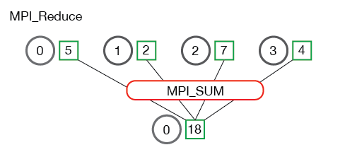
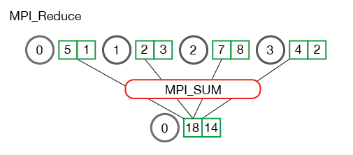

在 [上一节]({{ site.baseurl }}/tutorials/performing-parallel-rank-with-mpi) 中，我们介绍了一个使用`MPI_Scatter`和`MPI_Gather`的计算并行排名的示例。 。
在本课中，我们将通过`MPI_Reduce`和`MPI_Allreduce`进一步扩展集体通信例程。

> **Note** - 本教程的所有代码都在 [GitHub]({{ site.github.repo }}) 上。本教程的代码位于 [tutorials/mpi-reduce-and-allreduce/code]({{ site.github.code }}/tutorials/mpi-reduce-and-allreduce/code) 下。

## 归约简介

*归约* 是函数式编程中的经典概念。
数据归约包括通过函数将一组数字归约为较小的一组数字。
例如，假设我们有一个数字列表 `[1,2,3,4,5]`。
用 sum 函数归约此数字列表将产生 `sum([1、2、3、4、5]) = 15`。
类似地，乘法归约将产生 `multiply([1、2、3、4、5]) = 120`。

就像您想象的那样，在一组分布式数字上应用归约函数可能非常麻烦。
随之而来的是，难以有效地实现非可交换的归约，即必须以设定顺序发生的缩减。
幸运的是，MPI 有一个方便的函数，`MPI_Reduce`，它将处理程序员在并行程序中需要执行的几乎所有常见的归约操作。

## MPI_Reduce

与 `MPI_Gather` 类似，`MPI_Reduce` 在每个进程上获取一个输入元素数组，并将输出元素数组返回给根进程。
输出元素包含减少的结果。
`MPI_Reduce` 的原型如下所示：

```cpp
MPI_Reduce(
    void* send_data,
    void* recv_data,
    int count,
    MPI_Datatype datatype,
    MPI_Op op,
    int root,
    MPI_Comm communicator)
```

`send_data` 参数是每个进程都希望归约的 `datatype` 类型元素的数组。
`recv_data` 仅与具有 `root` 秩的进程相关。
`recv_data` 数组包含归约的结果，大小为`sizeof（datatype）* count`。
`op` 参数是您希望应用于数据的操作。
MPI 包含一组可以使用的常见归约运算。
尽管可以定义自定义归约操作，但这超出了本教程的范围。
MPI 定义的归约操作包括：

* `MPI_MAX` - 返回最大元素。
* `MPI_MIN` - 返回最小元素。
* `MPI_SUM` - 对元素求和。
* `MPI_PROD` - 将所有元素相乘。
* `MPI_LAND` - 对元素执行逻辑*与*运算。
* `MPI_LOR` - 对元素执行逻辑*或*运算。
* `MPI_BAND` - 对元素的各个位按位*与*执行。
* `MPI_BOR` - 对元素的位执行按位*或*运算。
* `MPI_MAXLOC` - 返回最大值和所在的进程的秩。
* `MPI_MINLOC` - 返回最小值和所在的进程的秩。

下面是 `MPI_Reduce` 通信模式的说明。



在上图中，每个进程包含一个整数。
调用 `MPI_Reduce` 的根进程为 0，并使用 `MPI_SUM` 作为归约运算。
这四个数字相加后将结果存储在根进程中。

查看当进程拥有多个元素时会发生什么也很有用。
下图显示了每个进程归约多个数字的情况。



上图中的每个进程都有两个元素。
结果求和基于每个元素进行。
换句话说，不是将所有数组中的所有元素累加到一个元素中，而是将每个数组中的第 i 个元素累加到进程 0 结果数组中的第 i 个元素中。

现在您了解了 `MPI_Reduce` 的外观，我们可以尝试一些代码示例。

## 使用 MPI_Reduce 计算均值

在 [上一节]({{ site.baseurl }}/tutorials/mpi-scatter-gather-and-allgather) 中，我们展示了如何使用 `MPI_Scatter` 和 `MPI_Gather` 计算平均值。
使用 `MPI_Reduce` 可以简化上一节的代码。
以下是本节示例代码中 [reduce_avg.c]({{ site.github.code }}/tutorials/mpi-reduce-and-allreduce/code/reduce_avg.c) 的片段。

```cpp
float *rand_nums = NULL;
rand_nums = create_rand_nums(num_elements_per_proc);

// Sum the numbers locally
float local_sum = 0;
int i;
for (i = 0; i < num_elements_per_proc; i++) {
  local_sum += rand_nums[i];
}

// Print the random numbers on each process
printf("Local sum for process %d - %f, avg = %f\n",
       world_rank, local_sum, local_sum / num_elements_per_proc);

// Reduce all of the local sums into the global sum
float global_sum;
MPI_Reduce(&local_sum, &global_sum, 1, MPI_FLOAT, MPI_SUM, 0,
           MPI_COMM_WORLD);

// Print the result
if (world_rank == 0) {
  printf("Total sum = %f, avg = %f\n", global_sum,
         global_sum / (world_size * num_elements_per_proc));
}
```

在上面的代码中，每个进程都会创建随机数并计算和保存在 `local_sum` 中。
然后使用 `MPI_SUM` 将 `local_sum` 归约至根进程。
然后，全局平均值为 `global_sum / (world_size * num_elements_per_proc)`。
如果您从 [repo]({{site.github.code}}) 的 *tutorials* 目录中运行 reduce_avg 程序，则输出应与此类似。

```
>>> cd tutorials
>>> ./run.py reduce_avg
mpirun -n 4  ./reduce_avg 100
Local sum for process 0 - 51.385098, avg = 0.513851
Local sum for process 1 - 51.842468, avg = 0.518425
Local sum for process 2 - 49.684948, avg = 0.496849
Local sum for process 3 - 47.527420, avg = 0.475274
Total sum = 200.439941, avg = 0.501100
```

现在是时候接触 `MPI_Reduce` 的同级对象 - `MPI_Allreduce` 了。

## MPI_Allreduce

许多并行程序中，需要在所有进程而不是仅仅在根进程中访问归约的结果。
以与 `MPI_Gather` 相似的补充方式，`MPI_Allreduce` 将归约值并将结果分配给所有进程。
函数原型如下：

```cpp
MPI_Allreduce(
    void* send_data,
    void* recv_data,
    int count,
    MPI_Datatype datatype,
    MPI_Op op,
    MPI_Comm communicator)
```

您可能已经注意到，`MPI_Allreduce` 与 `MPI_Reduce` 相同，不同之处在于它不需要根进程 ID（因为结果分配给所有进程）。
下图介绍了 `MPI_Allreduce` 的通信模式：


`MPI_Allreduce` 等效于先执行 `MPI_Reduce`，然后执行 `MPI_Bcast`。
很简单，对吧？

## 使用 MPI_Allreduce 计算标准差

许多计算问题需要进行多次归约来解决。
一个这样的问题是找到一组分布式数字的标准差。
或许您可能已经遗忘了什么是标准差，标准差是数字与均值之间的离散程度的度量。
较低的标准差表示数字靠得更近，对于较高的标准差则相反。

要找到标准差，必须首先计算所有数字的平均值。
总和均值的平方根是最终结果。
给定问题描述，我们知道所有数字至少会有两个和，转化为两个归约。
本文代码 [reduce_stddev.c]({{ site.github.code }}/tutorials/mpi-reduce-and-allreduce/code/reduce_stddev.c) 中的一个片段展示了如何应用 MPI 解决此问题的概况。

```cpp
rand_nums = create_rand_nums(num_elements_per_proc);

// Sum the numbers locally
float local_sum = 0;
int i;
for (i = 0; i < num_elements_per_proc; i++) {
  local_sum += rand_nums[i];
}

// Reduce all of the local sums into the global sum in order to
// calculate the mean
float global_sum;
MPI_Allreduce(&local_sum, &global_sum, 1, MPI_FLOAT, MPI_SUM,
              MPI_COMM_WORLD);
float mean = global_sum / (num_elements_per_proc * world_size);

// Compute the local sum of the squared differences from the mean
float local_sq_diff = 0;
for (i = 0; i < num_elements_per_proc; i++) {
  local_sq_diff += (rand_nums[i] - mean) * (rand_nums[i] - mean);
}

// Reduce the global sum of the squared differences to the root
// process and print off the answer
float global_sq_diff;
MPI_Reduce(&local_sq_diff, &global_sq_diff, 1, MPI_FLOAT, MPI_SUM, 0,
           MPI_COMM_WORLD);

// The standard deviation is the square root of the mean of the
// squared differences.
if (world_rank == 0) {
  float stddev = sqrt(global_sq_diff /
                      (num_elements_per_proc * world_size));
  printf("Mean - %f, Standard deviation = %f\n", mean, stddev);
}
```

在上面的代码中，每个进程都会计算元素的局部总和 `local_sum`，并使用 `MPI_Allreduce `对它们求和。
在所有进程上都有全局总和后，将计算均值 `mean`，以便可以计算局部距平的平方 `local_sq_diff`。
一旦计算出所有局部距平的平方，就可以通过使用 `MPI_Reduce` 得到全局距平的平方 `global_sq_diff`。
然后，根进程可以通过取全局距平的平方的平均值的平方根来计算标准差。

使用运行脚本运行示例代码将产生如下输出：

```
>>> ./run.py reduce_stddev
mpirun -n 4  ./reduce_stddev 100
Mean - 0.501100, Standard deviation = 0.301126
```

## Up next

现在您可以轻松使用所有常见的集合 - `MPI_Bcast`，`MPI_Scatter`，`MPI_Gather` 和 `MPI_Reduce`，我们可以利用它们来构建复杂的并行程序。
在下一节中，我们将开始研究 [MPI 组和通讯器]({{ site.baseurl }}/tutorials/introduction-to-groups-and-communicators/).

对于所有教程，请转到 [MPI 教程部分]({{ site.baseurl }}/tutorials/).
