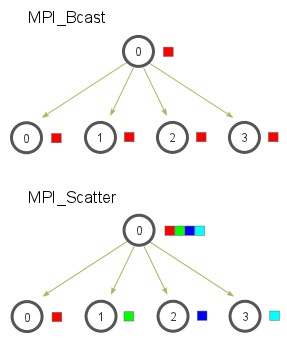
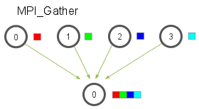

In the [previous lesson]({{ site.baseurl }}/tutorials/mpi-broadcast-and-collective-communication/), we went over the essentials of collective communication. We covered the most basic collective communication routine - `MPI_Bcast`. In this lesson, we are going to expand on collective communication routines by going over two very important routines - `MPI_Scatter` and `MPI_Gather`. We will also cover a variant of `MPI_Gather`, known as `MPI_Allgather`.

> **Note** - All of the code for this site is on [GitHub]({{ site.github.repo }}). This tutorial's code is under [tutorials/mpi-scatter-gather-and-allgather/code]({{ site.github.code }}/tutorials/mpi-scatter-gather-and-allgather/code).

## An introduction to MPI_Scatter
`MPI_Scatter` is a collective routine that is very similar to `MPI_Bcast` (If you are unfamiliar with these terms, please read the [previous lesson]({{ site.baseurl }}/tutorials/mpi-broadcast-and-collective-communication/)). `MPI_Scatter` involves a designated root process sending data to all processes in a communicator. The primary difference between `MPI_Bcast` and `MPI_Scatter` is small but important. `MPI_Bcast` sends the *same* piece of data to all processes while `MPI_Scatter` sends *chunks of an array* to different processes. Check out the illustration below for further clarification.



In the illustration, `MPI_Bcast` takes a single data element at the root process (the red box) and copies it to all other processes. `MPI_Scatter` takes an array of elements and distributes the elements in the order of process rank. The first element (in red) goes to process zero, the second element (in green) goes to process one, and so on. Although the root process (process zero) contains the entire array of data, `MPI_Scatter` will copy the appropriate element into the receiving buffer of the process. Here is what the function prototype of `MPI_Scatter` looks like.

```cpp
MPI_Scatter(
    void* send_data,
    int send_count,
    MPI_Datatype send_datatype,
    void* recv_data,
    int recv_count,
    MPI_Datatype recv_datatype,
    int root,
    MPI_Comm communicator)
```

Yes, the function looks big and scary, but let's examine it in more detail. The first parameter, `send_data`, is an array of data that resides on the root process. The second and third parameters, `send_count` and `send_datatype`, dictate how many elements of a specific MPI Datatype will be sent to each process. If `send_count` is one and `send_datatype` is `MPI_INT`, then process zero gets the first integer of the array, process one gets the second integer, and so on. If `send_count` is two, then process zero gets the first and second integers, process one gets the third and fourth, and so on. In practice, `send_count` is often equal to the number of elements in the array divided by the number of processes. What's that you say? The number of elements isn't divisible by the number of processes? Don't worry, we will cover that in a later lesson :-)

The receiving parameters of the function prototype are nearly identical in respect to the sending parameters. The `recv_data` parameter is a buffer of data that can hold `recv_count` elements that have a datatype of `recv_datatype`. The last parameters, `root` and `communicator`, indicate the root process that is scattering the array of data and the communicator in which the processes reside.

## An introduction to MPI_Gather
`MPI_Gather` is the inverse of `MPI_Scatter`. Instead of spreading elements from one process to many processes, `MPI_Gather` takes elements from many processes and gathers them to one single process. This routine is highly useful to many parallel algorithms, such as parallel sorting and searching. Below is a simple illustration of this algorithm.



Similar to `MPI_Scatter`, `MPI_Gather` takes elements from each process and gathers them to the root process. The elements are ordered by the rank of the process from which they were received. The function prototype for `MPI_Gather` is identical to that of `MPI_Scatter`.

```cpp
MPI_Gather(
    void* send_data,
    int send_count,
    MPI_Datatype send_datatype,
    void* recv_data,
    int recv_count,
    MPI_Datatype recv_datatype,
    int root,
    MPI_Comm communicator)
```

In `MPI_Gather`, only the root process needs to have a valid receive buffer. All other calling processes can pass `NULL` for `recv_data`. Also, don't forget that the *recv_count* parameter is the count of elements received *per process*, not the total summation of counts from all processes. This can often confuse beginning MPI programmers.

## Computing average of numbers with MPI_Scatter and MPI_Gather
In the [code for this lesson]({{ site.github.code }}/tutorials/mpi-scatter-gather-and-allgather/code), I have provided an example program ([avg.c]({{ site.github.code }}/tutorials/mpi-scatter-gather-and-allgather/code/avg.c)) that computes the average across all numbers in an array. Although the program is quite simple, it demonstrates how one can use MPI to divide work across processes, perform computation on subsets of data, and then aggregate the smaller pieces into the final answer. The program takes the following steps:

1. Generate a random array of numbers on the root process (process 0).
2. Scatter the numbers to all processes, giving each process an equal amount of numbers.
3. Each process computes the average of their subset of the numbers.
4. Gather all averages to the root process. The root process then computes the average of these numbers to get the final average.

The main part of the code with the MPI calls looks like this:

```cpp
if (world_rank == 0) {
  rand_nums = create_rand_nums(elements_per_proc * world_size);
}

// Create a buffer that will hold a subset of the random numbers
float *sub_rand_nums = malloc(sizeof(float) * elements_per_proc);

// Scatter the random numbers to all processes
MPI_Scatter(rand_nums, elements_per_proc, MPI_FLOAT, sub_rand_nums,
            elements_per_proc, MPI_FLOAT, 0, MPI_COMM_WORLD);

// Compute the average of your subset
float sub_avg = compute_avg(sub_rand_nums, elements_per_proc);
// Gather all partial averages down to the root process
float *sub_avgs = NULL;
if (world_rank == 0) {
  sub_avgs = malloc(sizeof(float) * world_size);
}
MPI_Gather(&sub_avg, 1, MPI_FLOAT, sub_avgs, 1, MPI_FLOAT, 0,
           MPI_COMM_WORLD);

// Compute the total average of all numbers.
if (world_rank == 0) {
  float avg = compute_avg(sub_avgs, world_size);
}
```

At the beginning of the code, the root process creates an array of random numbers. When `MPI_Scatter` is called, each process now contains `elements_per_proc` elements of the original data. Each process computes the average of their subset of data and then the root process gathers each individual average. The total average is computed on this much smaller array of numbers.

If you run the avg program from the *tutorials* directory of the [repo]({{ site.github.code }}), the output should look similar to this. Note that the numbers are randomly generated, so your final result might be different from mine.

```
>>> cd tutorials
>>> ./run.py avg
/home/kendall/bin/mpirun -n 4 ./avg 100
Avg of all elements is 0.478699
Avg computed across original data is 0.478699
```

## MPI_Allgather and modification of average program
So far, we have covered two MPI routines that perform *many-to-one* or *one-to-many* communication patterns, which simply means that many processes send/receive to one process. Oftentimes it is useful to be able to send many elements to many processes (i.e. a *many-to-many* communication pattern). `MPI_Allgather` has this characteristic.

Given a set of elements distributed across all processes, `MPI_Allgather` will gather all of the elements to all the processes. In the most basic sense, `MPI_Allgather` is an `MPI_Gather` followed by an `MPI_Bcast`. The illustration below shows how data is distributed after a call to `MPI_Allgather`.


Just like `MPI_Gather`, the elements from each process are gathered in order of their rank, except this time the elements are gathered to all processes. Pretty easy, right? The function declaration for `MPI_Allgather` is almost identical to `MPI_Gather` with the difference that there is no root process in `MPI_Allgather`.

```cpp
MPI_Allgather(
    void* send_data,
    int send_count,
    MPI_Datatype send_datatype,
    void* recv_data,
    int recv_count,
    MPI_Datatype recv_datatype,
    MPI_Comm communicator)
```

I have modified the average computation code to use `MPI_Allgather`. You can view the source in [all_avg.c]({{ site.github.code }}/tutorials/mpi-scatter-gather-and-allgather/code/all_avg.c) from the [code for this lesson]({{ site.github.code }}/tutorials/mpi-scatter-gather-and-allgather/code). The main difference in the code is shown below.

```cpp
// Gather all partial averages down to all the processes
float *sub_avgs = (float *)malloc(sizeof(float) * world_size);
MPI_Allgather(&sub_avg, 1, MPI_FLOAT, sub_avgs, 1, MPI_FLOAT,
              MPI_COMM_WORLD);

// Compute the total average of all numbers.
float avg = compute_avg(sub_avgs, world_size);
```

The partial averages are now gathered to everyone using `MPI_Allgather`. The averages are now printed off from all of the processes. Example output of the program should look like the following:

```
>>> ./run.py all_avg
/home/kendall/bin/mpirun -n 4 ./all_avg 100
Avg of all elements from proc 1 is 0.479736
Avg of all elements from proc 3 is 0.479736
Avg of all elements from proc 0 is 0.479736
Avg of all elements from proc 2 is 0.479736
```

As you may have noticed, the only difference between all_avg.c and avg.c is that all_avg.c prints the average across all processes with `MPI_Allgather`.

## Up next
In the next lesson, I cover an application example of using `MPI_Gather` and `MPI_Scatter` to [perform parallel rank computation]({{ site.baseurl }}/tutorials/performing-parallel-rank-with-mpi/).

For all lessons, go the the [MPI tutorials]({{ site.baseurl }}/tutorials/).