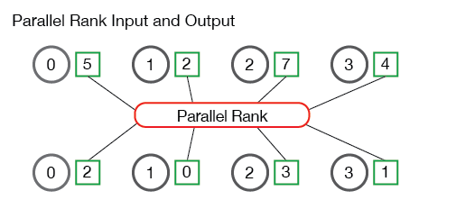
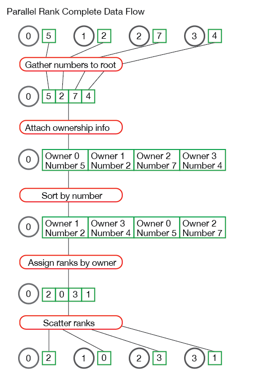

在[之前的课程]({{ site.baseurl }}/tutorials/mpi-scatter-gather-and-allgather/)里，我们介绍了 `MPI_Scatter`、`MPI_Gather` 和 `MPI_Allgather`。在这一节中，我们将通过为MPI工具包编写一个实用的功能——并行排名来拓展基本的集体通信（collective communication）。

> **注意** - 这个网站的提到的所有代码都在 [GitHub]({{ site.github.repo }}) 上面。这篇教程的代码在 [tutorials/performing-parallel-rank-with-mpi/code]({{ site.github.code }}/tutorials/performing-parallel-rank-with-mpi/code)。

## 并行排名 - 问题概述
当每一个进程都在其本地内存中存储了一​​个数，所有进程中存储的数字构成了一个数字集合（set of numbers），了解该数相对于整个数字集合的顺序是有用的。例如，用户可能正在对MPI群集中的处理器进行基准测试，并想知道每个处理器相对于其他处理器有多快。这个信息可用于安排、调度任务等。可以想象，如果所有其他数字分散在各个进程中，那么很难找出一个数字相对于所有其他数字的顺序。这个并行排名问题是我们在本课中要解决的问题。

下图说明了并行排名的输入和输出：



图示中的进程（标记为0到3）开始时有四个数字—— 5、2、7和4。然后，并行排名算法算出进程1在数字集合中的排名为0（即第一个数字），进程3排名为1，进程0排名为2，进程2排在整个数字集合的最后。很简单，对吧？

## 并行排名API定义
在深入研究并行排名问题之前，让我们首先确定函数的行为方式。我们的函数需要在每个进程上取一个数字，并返回其相对于所有其他进程中的数字的排名。与此同时，我们将需要其他各种信息，例如正在使用的通讯器（communicator）以及被排名的数字的数据类型。 给定这个函数定义后，我们的排名函数原型如下所示：

 ```cpp
TMPI_Rank(
    void *send_data,
    void *recv_data,
    MPI_Datatype datatype,
    MPI_Comm comm)
```

`TMPI_Rank` 把 `send_data` 作为缓冲区，其中包含一个类型为 `datatype` 的数字。
`recv_data` 在每个进程中只接收一个整数，即 `send_data` 的排名。`comm` 变量是进行排名的通讯器。

> **注意** - MPI标准明确指出，用户不应以 `MPI` 起头命名自己的函数，如 `MPI_<something>`，以避免将用户函数与MPI标准本身的函数混淆。 因此，在这些教程中，我们将在函数前面加上 `T`。

## 解决并行排名问题
现在我们有了API定义，我们可以深入研究如何解决并行排名问题。解决并行排名问题的第一步是对所有进程中的数字进行排序。 这一点必须做到，以便我们找到整个数字集中每个数字的排名。我们可以通过多种方式来实现这一目标。最简单的方法是将所有数字收集到一个进程中并对数字进行排序。在示例代码([tmpi_rank.c]({{ site.github.code }}/tutorials/performing-parallel-rank-with-mpi/code/tmpi_rank.c))中，`gather_numbers_to_root` 函数负责将所有数字收集到根进程（root process）。

```cpp
// 为进程0的TMPI_Rank收集数字。为MPI的数据类型分配空间
// 对进程0返回 void * 指向的缓冲区
// 对所有其他进程返回NULL
void *gather_numbers_to_root(void *number, MPI_Datatype datatype,
                             MPI_Comm comm) {
  int comm_rank, comm_size;
  MPI_Comm_rank(comm, &comm_rank);
  MPI_Comm_size(comm, &comm_size);

  // 在根进程上分配一个数组
  // 数组大小取决于所用的MPI数据类型
  int datatype_size;
  MPI_Type_size(datatype, &datatype_size);
  void *gathered_numbers;
  if (comm_rank == 0) {
    gathered_numbers = malloc(datatype_size * comm_size);
  }

  // 在根进程上收集所有数字
  MPI_Gather(number, 1, datatype, gathered_numbers, 1,
             datatype, 0, comm);

  return gathered_numbers;
}
```

`gather_numbers_to_root` 函数获取要收集的数字（即 `send_data` 变量）、数字的数据类型 `datatype` 和 `comm` 通讯器。根进程必须在此函数中收集 `comm_size` 个数字，因此它会分配 `datatype_size * comm_size` 长度的数组。在本教程中，通过使用新的MPI函数- `MPI_Type_size` 来收集`datatype_size`变量。尽管我们的代码仅支持将 `MPI_INT` 和 `MPI_FLOAT` 作为数据类型，但可将其扩展以支持不同大小的数据类型。 在使用 `MPI_Gather` 在根进程上收集了数字之后，必须在根进程上对数字进行排序，以确定它们排名。

## 排序数字并维护所属
在我们的排名函数中，排序数字不一定是难题。 C标准库为我们提供了流行的排序算法，例如 `qsort`。 在并行排名问题中，排序的困难在于，我们必须维护各个进程将数字发送到根进程的次序。 如果我们要对收集到根进程的数组进行排序而不给数字附加信息，则根进程将不知道如何将数字的排名发送回原来请求的进程！

为了便于将所属进程附到对应数字上，我们在代码中创建了一个结构体（struct）来保存此信息。 我们的结构定义如下：

```cpp
// 保存进程在通讯器中的次序（rank）和对应数字
// 该结构体用于数组排序，
// 并同时完整保留所属进程信息

typedef struct {
  int comm_rank;
  union {
    float f;
    int i;
  } number;
} CommRankNumber;
```

`CommRankNumber` 结构体保存了我们要排序的数字（记住它可以是浮点数或整数，因此我们使用联合体union），并且它拥有该数字所属进程在通讯器中的次序（rank）。 代码的下一部分，即 `get_ranks` 函数，负责创建这些结构体并对它们进行排序。


```cpp
// 这个函数在根进程上对收集到的数字排序
// 返回一个数组，数组按进程在通讯器中的次序排序
// 注意 - 该函数只在根进程上运行

int *get_ranks(void *gathered_numbers, int gathered_number_count,
               MPI_Datatype datatype) {
  int datatype_size;
  MPI_Type_size(datatype, &datatype_size);

  // 将收集到的数字数组转换为CommRankNumbers数组
  // 这允许我们在排序的同时，完整保留数字所属进程的信息
  
  CommRankNumber *comm_rank_numbers = malloc(
    gathered_number_count * sizeof(CommRankNumber));
  int i;
  for (i = 0; i < gathered_number_count; i++) {
    comm_rank_numbers[i].comm_rank = i;
    memcpy(&(comm_rank_numbers[i].number),
           gathered_numbers + (i * datatype_size),
           datatype_size);
  }

  // 根据数据类型对comm_rank_numbers排序
  if (datatype == MPI_FLOAT) {
    qsort(comm_rank_numbers, gathered_number_count,
          sizeof(CommRankNumber), &compare_float_comm_rank_number);
  } else {
    qsort(comm_rank_numbers, gathered_number_count,
          sizeof(CommRankNumber), &compare_int_comm_rank_number);
  }

  // 现在comm_rank_numbers是排好序的，下面生成一个数组，
  // 包含每个进程的排名，数组第i个元素是进程i的数字的排名
  
  int *ranks = (int *)malloc(sizeof(int) * gathered_number_count);
  for (i = 0; i < gathered_number_count; i++) {
    ranks[comm_rank_numbers[i].comm_rank] = i;
  }

  // 清理并返回排名数组
  free(comm_rank_numbers);
  return ranks;
}
```

`get_ranks` 函数首先创建一个CommRankNumber结构体数组，并附上该数字所属进程在通讯器中的次序。 如果数据类型为 `MPI_FLOAT` ，则对我们的结构体数组调用 `qsort` 时，会使用特殊的排序函数，（代码见[tmpi_rank.c]({{ site.github.code }}/tutorials/performing-parallel-rank-with-mpi/code/tmpi_rank.c)。 类似的，如果数据类型为 `MPI_INT` ，我们将使用不同的排序函数。

在对数字进行排序之后，我们必须以适当的顺序创建一个排名数组（array of ranks），以便将它们分散（scatter）回到请求的进程中。这是通过创建 `ranks` 数组并为每个已排序的 `CommRankNumber` 结构体填充适当的排名来实现的。

## 整合
现在我们有了两个主要函数，我们可以将它们全部整合到我们的 `TMPI_Rank` 函数中。此函数将数字收集到根进程，并对数字进行排序以确定其排名，然后将排名分散回请求的进程。 代码如下所示：

```cpp
// 获取send_data的排名, 类型为datatype
// 排名用recv_data返回，类型为datatype
int TMPI_Rank(void *send_data, void *recv_data, MPI_Datatype datatype,
             MPI_Comm comm) {
  // 首先检查基本情况 - 此函数只支持MPI_INT和MPI_FLOAT

  if (datatype != MPI_INT && datatype != MPI_FLOAT) {
    return MPI_ERR_TYPE;
  }

  int comm_size, comm_rank;
  MPI_Comm_size(comm, &comm_size);
  MPI_Comm_rank(comm, &comm_rank);

  // 为了计算排名，必须将数字收集到一个进程中
  // 对数字排序, 然后将排名结果分散传回
  // 首先在进程0上收集数字
  void *gathered_numbers = gather_numbers_to_root(send_data, datatype,
                                                  comm);

  // 获取每个进程的次序（rank)
  int *ranks = NULL;
  if (comm_rank == 0) {
    ranks = get_ranks(gathered_numbers, comm_size, datatype);
  }

  // 分散发回排名结果
  MPI_Scatter(ranks, 1, MPI_INT, recv_data, 1, MPI_INT, 0, comm);

  // 清理
  if (comm_rank == 0) {
    free(gathered_numbers);
    free(ranks);
  }
}
```

`TMPI_Rank` 函数使用我们刚刚创建的两个函数 `gather_numbers_to_root` 和 `get_ranks` 来获取数字的排名。然后，函数执行最后的 `MPI_Scatter`，以将所得的排名分散传回进程。

如果你在阅读并行排名问题的解决方案时遇到麻烦，那么我将使用一组示例数据对问题的整个数据流进行了说明：



对并行秩算法如何工作有疑问吗？ 把它们留在下面！

## 运行我们的并行排名算法
我已在示例代码中包含了一个小程序，以帮助测试我们的并行排名算法。代码见[课程代码]({{ site.github.code }}/tutorials/performing-parallel-rank-with-mpi/code)中的[random_rank.c]({{ site.github.code }}/tutorials/performing-parallel-rank-with-mpi/code/random_rank.c)文件。

该示例应用程序只是在每个进程上创建一个随机数，然后调用 `TMPI_Rank` 以获取每个数的排名。如果从[代码库]({{ site.github.code }})的 *tutorials* 目录中运行 `random_rank` 程序，则输出应与此类似。

```
>>> cd tutorials
>>> ./run.py random_rank
mpirun -n 4  ./random_rank 100
Rank for 0.242578 on process 0 - 0
Rank for 0.894732 on process 1 - 3
Rank for 0.789463 on process 2 - 2
Rank for 0.684195 on process 3 - 1
```

## 接下来
在下一节中，我们将开始介绍进阶的集体通信。 下一节课是关于[用 MPI_Reduce 和 MPI_Allreduce 对数字执行reduce]({{ site.baseurl }}/tutorials/mpi-reduce-and-allreduce/)。

For all lessons, go the the [MPI tutorials]({{ site.baseurl }}/tutorials/).
