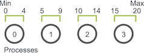
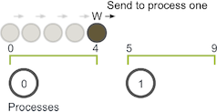
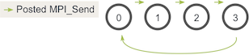
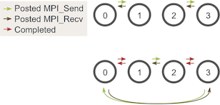
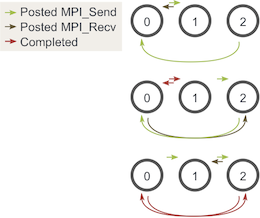

It's time to go through an application example using some of the concepts introduced in the [sending and receiving tutorial]({{ site.baseurl }}/tutorials/mpi-send-and-receive/) and the [MPI_Probe and MPI_Status lesson]({{ site.baseurl }}/tutorials/dynamic-receiving-with-mpi-probe-and-mpi-status/). The application simulates a process which I refer to as "random walking."

> **Note** - All of the code for this site is on [GitHub]({{ site.github.repo }}). This tutorial's code is under [tutorials/point-to-point-communication-application-random-walk/code]({{ site.github.code }}/tutorials/point-to-point-communication-application-random-walk/code).
 
The basic problem definition of a random walk is as follows. Given a *Min*, *Max*, and random walker *W*, make walker *W* take *S* random walks of arbitrary length to the right. If the process goes out of bounds, it wraps back around. *W* can only move one unit to the right or left at a time.


Although the application in itself is very basic, the parallelization of random walking can simulate the behavior of a wide variety of parallel applications. More on that later. For now, let's overview how to parallelize the random walk problem.

## Parallelization of the random walking problem
Our first task, which is pertinent to many parallel programs, is splitting the domain across processes. The random walk problem has a one-dimensional domain of size *Max - Min + 1* (since *Max* and *Min* are inclusive to the walker). Assuming that walkers can only take integer-sized steps, we can easily partition the domain into near-equal-sized chunks across processes. For example, if *Min* is 0 and *Max* is 20 and we have four processes, the domain would be split like this.



The first three processes own five units of the domain while the last process takes the last five units plus the one remaining unit.
Once the domain has been partitioned, the application will initialize walkers. As explained earlier, a walker will take *S* walks with a random total walk size. For example, if the walker takes a walk of size six on process zero (using the previous domain decomposition), the execution of the walker will go like this:

1. The walker starts taking incremental steps. When it hits value four, however, it has reached the end of the bounds of process zero. Process zero now has to communicate the walker to process one.

2. Process one receives the walker and continues walking until it has reached its total walk size of six. The walker can then proceed on a new random walk.



In this example, *W* only had to be communicated one time from process zero to process one. If *W* had to take a longer walk, however, it may have needed to be passed through more processes along its path through the domain. 

## Coding the application using MPI_Send and MPI_Recv
This application can be coded using `MPI_Send` and `MPI_Recv`. Before we begin looking at code, let's establish some preliminary characteristics and functions of the program:

* Each process determines their part of the domain.
* Each process initializes exactly *N* walkers, all which start at the first value of their local domain.
* Each walker has two associated integer values: the current position of the walker and the number of steps left to take.
* Walkers start traversing through the domain and are passed to other processes until they have completed their walk.
* The processes terminate when all walkers have finished.

Let's begin by writing code for the domain decomposition. The function will take in the total domain size and find the appropriate subdomain for the MPI process. It will also give any remainder of the domain to the final process. For simplicity, I just call `MPI_Abort` for any errors that are found. The function, called `decompose_domain`, looks like this:

```cpp
void decompose_domain(int domain_size, int world_rank,
                      int world_size, int* subdomain_start,
                      int* subdomain_size) {
    if (world_size > domain_size) {
        // Don't worry about this special case. Assume the domain
        // size is greater than the world size.
        MPI_Abort(MPI_COMM_WORLD, 1);
    }
    *subdomain_start = domain_size / world_size * world_rank;
    *subdomain_size = domain_size / world_size;
    if (world_rank == world_size - 1) {
        // Give remainder to last process
        *subdomain_size += domain_size % world_size;
    }
  }
```

As you can see, the function splits the domain in even chunks, taking care of the case when a remainder is present. The function returns a subdomain start and a subdomain size.

Next, we need to create a function that initializes walkers. We first define a walker structure that looks like this:

```cpp
typedef struct {
    int location;
    int num_steps_left_in_walk;
} Walker;
```

Our initialization function, called `initialize_walkers`, takes the subdomain bounds and adds walkers to an `incoming_walkers` vector (by the way, this application is in C++).

```cpp
void initialize_walkers(int num_walkers_per_proc, int max_walk_size,
                        int subdomain_start, int subdomain_size,
                        vector<Walker>* incoming_walkers) {
    Walker walker;
    for (int i = 0; i < num_walkers_per_proc; i++) {
        // Initialize walkers in the middle of the subdomain
        walker.location = subdomain_start;
        walker.num_steps_left_in_walk =
            (rand() / (float)RAND_MAX) * max_walk_size;
        incoming_walkers->push_back(walker);
    }
}
```

After initialization, it is time to progress the walkers. Let's start off by making a walking function. This function is responsible for progressing the walker until it has finished its walk. If it goes out of local bounds, it is added to the `outgoing_walkers` vector.

```cpp
void walk(Walker* walker, int subdomain_start, int subdomain_size,
          int domain_size, vector<Walker>* outgoing_walkers) {
    while (walker->num_steps_left_in_walk > 0) {
        if (walker->location == subdomain_start + subdomain_size) {
            // Take care of the case when the walker is at the end
            // of the domain by wrapping it around to the beginning
            if (walker->location == domain_size) {
                walker->location = 0;
            }
            outgoing_walkers->push_back(*walker);
            break;
        } else {
            walker->num_steps_left_in_walk--;
            walker->location++;
        }
    }
}
```

Now that we have established an initialization function (that populates an incoming walker list) and a walking function (that populates an outgoing walker list), we only need two more functions: a function that sends outgoing walkers and a function that receives incoming walkers. The sending function looks like this:

```cpp
void send_outgoing_walkers(vector<Walker>* outgoing_walkers, 
                           int world_rank, int world_size) {
    // Send the data as an array of MPI_BYTEs to the next process.
    // The last process sends to process zero.
    MPI_Send((void*)outgoing_walkers->data(), 
             outgoing_walkers->size() * sizeof(Walker), MPI_BYTE,
             (world_rank + 1) % world_size, 0, MPI_COMM_WORLD);

    // Clear the outgoing walkers
    outgoing_walkers->clear();
}
```

The function that receives incoming walkers should use `MPI_Probe` since it does not know beforehand how many walkers it will receive. This is what it looks like:

```cpp
void receive_incoming_walkers(vector<Walker>* incoming_walkers,
                              int world_rank, int world_size) {
    MPI_Status status;

    // Receive from the process before you. If you are process zero,
    // receive from the last process
    int incoming_rank =
        (world_rank == 0) ? world_size - 1 : world_rank - 1;
    MPI_Probe(incoming_rank, 0, MPI_COMM_WORLD, &status);

    // Resize your incoming walker buffer based on how much data is
    // being received
    int incoming_walkers_size;
    MPI_Get_count(&status, MPI_BYTE, &incoming_walkers_size);
    incoming_walkers->resize(
        incoming_walkers_size / sizeof(Walker));
    MPI_Recv((void*)incoming_walkers->data(), incoming_walkers_size,
             MPI_BYTE, incoming_rank, 0, MPI_COMM_WORLD,
             MPI_STATUS_IGNORE); 
}
```

Now we have established the main functions of the program. We have to tie all these function together as follows:

1. Initialize the walkers.
2. Progress the walkers with the `walk` function.
3. Send out any walkers in the `outgoing_walkers` vector.
4. Receive new walkers and put them in the `incoming_walkers` vector.
5. Repeat steps two through four until all walkers have finished.

The first attempt at writing this program is below. For now, we will not worry about how to determine when all walkers have finished. Before you look at the code, I must warn you - this code is incorrect! With this in mind, lets look at my code and hopefully you can see what might be wrong with it.

```cpp
// Find your part of the domain
decompose_domain(domain_size, world_rank, world_size,
                 &subdomain_start, &subdomain_size);

// Initialize walkers in your subdomain
initialize_walkers(num_walkers_per_proc, max_walk_size,
                   subdomain_start, subdomain_size,
                   &incoming_walkers);

while (!all_walkers_finished) { // Determine walker completion later
    // Process all incoming walkers
    for (int i = 0; i < incoming_walkers.size(); i++) {
        walk(&incoming_walkers[i], subdomain_start, subdomain_size,
             domain_size, &outgoing_walkers); 
    }

    // Send all outgoing walkers to the next process.
    send_outgoing_walkers(&outgoing_walkers, world_rank,
                          world_size);

    // Receive all the new incoming walkers
    receive_incoming_walkers(&incoming_walkers, world_rank,
                             world_size);
}
```

Everything looks normal, but the order of function calls has introduced a very likely scenario - **deadlock**. 

## Deadlock and prevention
According to Wikipedia, deadlock "*refers to a specific condition when two or more processes are each waiting for the other to release a resource, or more than two processes are waiting for resources in a circular chain.*" In our case, the above code will result in a circular chain of `MPI_Send` calls. 



It is worth noting that the above code will actually **not** deadlock most of the time. Although `MPI_Send` is a blocking call, the [MPI specification](http://www.amazon.com/gp/product/0262692163/ref=as_li_tf_tl?ie=UTF8&tag=softengiintet-20&linkCode=as2&camp=217145&creative=399377&creativeASIN=0262692163) says that MPI_Send blocks until **the send buffer can be reclaimed.** This means that `MPI_Send` will return when the network can buffer the message. If the sends eventually can't be buffered by the network, they will block until a matching receive is posted. In our case, there are enough small sends and frequent matching receives to not worry about deadlock, however, a big enough network buffer should never be assumed.

Since we are only focusing on `MPI_Send` and `MPI_Recv` in this lesson, the best way to avoid the possible sending and receiving deadlock is to order the messaging such that sends will have matching receives and vice versa. One easy way to do this is to change our loop around such that even-numbered processes send outgoing walkers before receiving walkers and odd-numbered processes do the opposite. Given two stages of execution, the sending and receiving will now look like this:



> **Note** - Executing this with one process can still deadlock. To avoid this, simply don't perform sends and receives when using one process.

You may be asking, does this still work with an odd number of processes? We can go through a similar diagram again with three processes:



As you can see, at all three stages, there is at least one posted `MPI_Send` that matches a posted `MPI_Recv`, so we don't have to worry about the occurrence of deadlock.

## Determining completion of all walkers
Now comes the final step of the program - determining when every single walker has finished. Since walkers can walk for a random length, they can finish their journey on any process. Because of this, it is difficult for all processes to know when all walkers have finished without some sort of additional communication. One possible solution is to have process zero keep track of all of the walkers that have finished and then tell all the other processes when to terminate. This solution, however, is quite cumbersome since each process would have to report any completed walkers to process zero and then also handle different types of incoming messages. 

For this lesson, we will keep things simple. Since we know the maximum distance that any walker can travel and the smallest total size it can travel for each pair of sends and receives (the subdomain size), we can figure out the amount of sends and receives each process should do before termination. Using this characteristic of the program along with our strategy to avoid deadlock, the final main part of the program looks like this:

```cpp
// Find your part of the domain
decompose_domain(domain_size, world_rank, world_size,
                 &subdomain_start, &subdomain_size);

// Initialize walkers in your subdomain
initialize_walkers(num_walkers_per_proc, max_walk_size,
                  subdomain_start, subdomain_size,
                  &incoming_walkers);

// Determine the maximum amount of sends and receives needed to 
// complete all walkers
int maximum_sends_recvs =
    max_walk_size / (domain_size / world_size) + 1;
for (int m = 0; m < maximum_sends_recvs; m++) {
    // Process all incoming walkers
    for (int i = 0; i < incoming_walkers.size(); i++) {
        walk(&incoming_walkers[i], subdomain_start, subdomain_size,
             domain_size, &outgoing_walkers); 
    }

    // Send and receive if you are even and vice versa for odd
    if (world_rank % 2 == 0) {
        send_outgoing_walkers(&outgoing_walkers, world_rank,
                              world_size);
        receive_incoming_walkers(&incoming_walkers, world_rank,
                                 world_size);
    } else {
        receive_incoming_walkers(&incoming_walkers, world_rank,
                                 world_size);
        send_outgoing_walkers(&outgoing_walkers, world_rank,
                              world_size);
    }
}
```

## Running the application
The [lesson code is viewable here]({{ site.github.code }}/tutorials/point-to-point-communication-application-random-walk/code). In contrast to the other lessons, this code uses C++. When [installing MPICH2]({{ site.baseurl }}/tutorials/installing-mpich2/), you also installed the C++ MPI compiler (unless you explicitly configured it otherwise). If you installed MPICH2 in a local directory, make sure that you have set your MPICXX environment variable to point to the correct mpicxx compiler in order to use my makefile.

In my code, I have set up the application run script to provide default values for the program: 100 for the domain size, 500 for the maximum walk size, and 20 for the number of walkers per process. If you run the random_walk program from the *tutorials* directory of the [repo]({{ site.github.code }}), it should spawn 5 processes and produce output similar to this.

```
>>> cd tutorials
>>> ./run.py random_walk
mpirun -n 5 ./random_walk 100 500 20
Process 2 initiated 20 walkers in subdomain 40 - 59
Process 2 sending 18 outgoing walkers to process 3
Process 3 initiated 20 walkers in subdomain 60 - 79
Process 3 sending 20 outgoing walkers to process 4
Process 3 received 18 incoming walkers
Process 3 sending 18 outgoing walkers to process 4
Process 4 initiated 20 walkers in subdomain 80 - 99
Process 4 sending 18 outgoing walkers to process 0
Process 0 initiated 20 walkers in subdomain 0 - 19
Process 0 sending 17 outgoing walkers to process 1
Process 0 received 18 incoming walkers
Process 0 sending 16 outgoing walkers to process 1
Process 0 received 20 incoming walkers
```

The output continues until processes finish all sending and receiving of all walkers.

## So what's next?
If you have made it through this entire application and feel comfortable, then good! This application is quite advanced for a first real application.

Next, we will start learning about *collective* communication in MPI. We will start off by going over [MPI Broadcast]({{ site.baseurl }}/tutorials/mpi-broadcast-and-collective-communication/). For all lessons, go to the [MPI tutorials]({{ site.baseurl }}/tutorials/).

Also, at the beginning, I told you that the concepts of this program are applicable to many parallel programs. I don't want to leave you hanging, so I have included some additional reading material below for anyone that wishes to learn more. Enjoy :-)

## Additional reading - Random walking and its similarity to parallel particle tracing
The random walk problem that we just coded, although seemingly trivial, can actually form the basis of simulating many types of parallel applications. Some parallel applications in the scientific domain require many types of randomized sends and receives. One example application is parallel particle tracing.


Parallel particle tracing is one of the primary methods that are used to visualize flow fields. Particles are inserted into the flow field and then traced along the flow using numerical integration techniques (such as Runge-Kutta). The traced paths can then be rendered for visualization purposes. One example rendering is of the tornado image at the top left.

Performing efficient parallel particle tracing can be very difficult. The main reason for this is because the direction in which particles travel can only be determined after each incremental step of the integration. Therefore, it is hard for processes to coordinate and balance all communication and computation. To understand this better, lets look at a typical parallelization of particle tracing.


In this illustration, we see that the domain is split among six process. Particles (sometimes referred to as *seeds*) are then placed in the subdomains (similar to how we placed walkers in subdomains), and then they begin tracing. When particles go out of bounds, they have to be exchanged with processes which have the proper subdomain. This process is repeated until the particles have either left the entire domain or have reached a maximum trace length.

The parallel particle tracing problem can be solved with `MPI_Send`, `MPI_Recv`, and `MPI_Probe` in a similar manner to our application that we just coded. There are, however, much more sophisticated MPI routines that can get the job done more efficiently. We will talk about these in the coming lessons :-) 

I hope you can now see at least one example of how the random walk problem is similar to other parallel applications!
